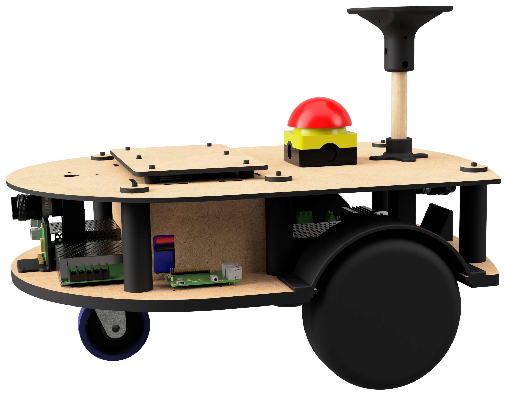
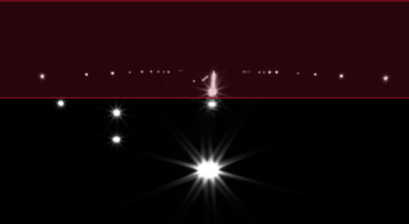
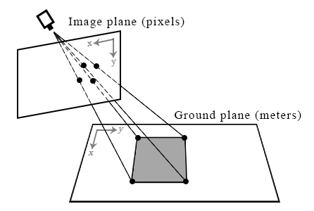
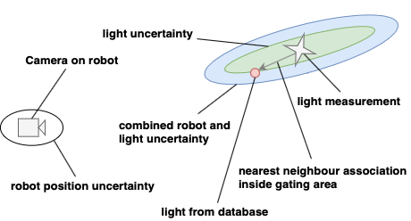
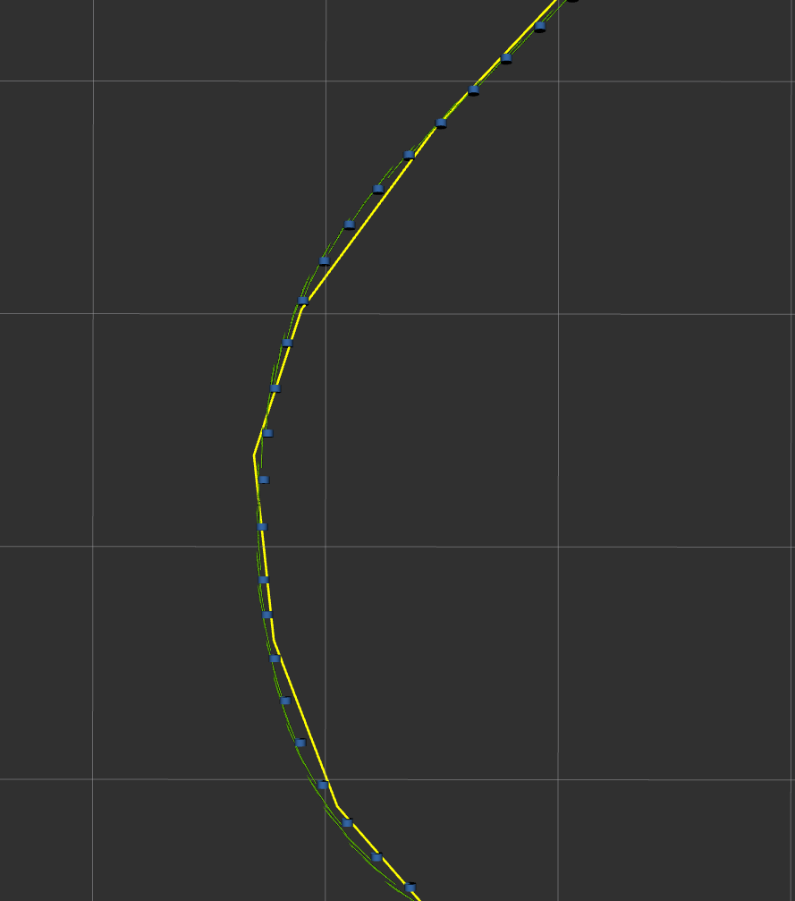
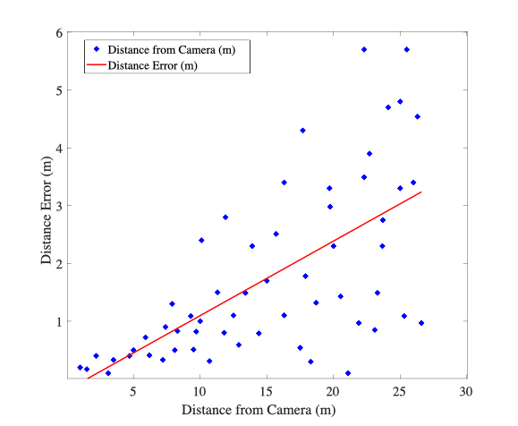
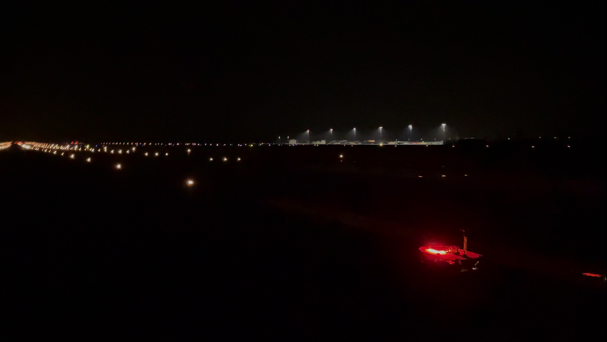
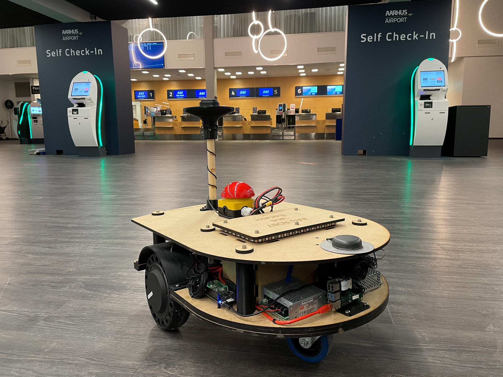
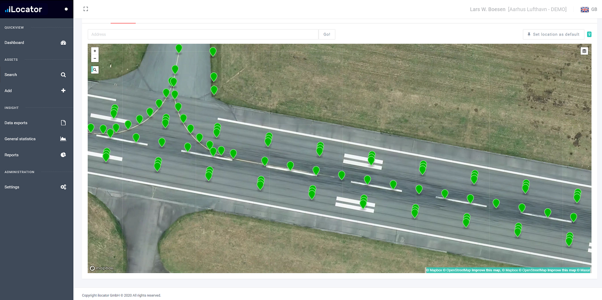
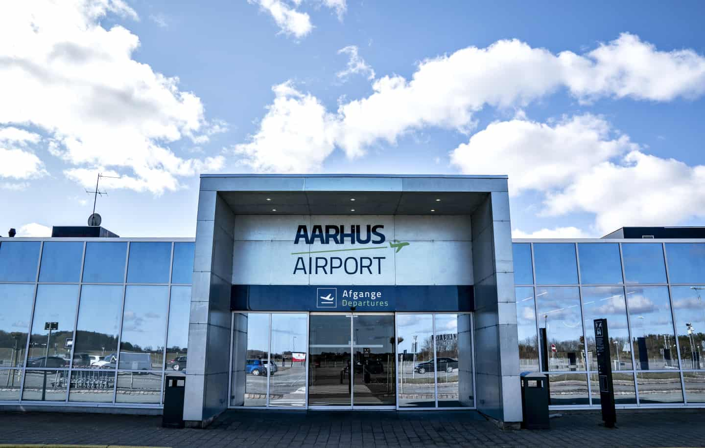

# Inspection of Ground Embedded Runway Lights through Monoscopic Camera via Mobile Robotics

[](https://www.youtube.com/watch?v=exDbzcol3cY&feature=youtu.be)


The aim of this work was to investigate the potential of an automated solution for inspection of ground-embedded runway-lights, with no humans-in-the-loop. A prototype differential-drive mobile robot featuring two monoscopic cameras, communicating with a database of positions from ground-embedded runway-lights was built and tested on an airport. Tests indicated promising results for further research and expansion of the current robotic-platform-solution as a functional and viable solution for automatic inspection of runway-lights. Accuracy test requirements demanded a maximum distance error of 15 meters with a maximum angular error of 2.9°. Results showed the robot was able to maneuver around a predefined path with a mean heading angular error of 1.6°. Runway light-detection test of a set of 58 runway-lights concluded on a 6 meter accuracy, with a maximum angular error of 1.7°. Both of these results within the required specifications. The significance of these results demonstrate the viability of this paper's robotic system in runway light-detection within minimum specification, as well as usage of the detection methods to determine which lights need human intervention for replacement or maintenance.

## 1. Introduction
Thousands of planes land every day in airports around the world . In order to navigate the runways, indicator lights for landing zones and taxi routes are necessary. Failure in lighting can result in catastrophic failure in plane navigation. Runway light inspection is therefore necessary and required by regulation, with this procedure currently being done manually in airports around the world. Manual inspection of runway lights is done by driving to all light locations and verifying colour, intensity, functionality, and visibility. Issues of this method are the monotonous nature of the task, leading to possible human errors, along with the associated dangers of unnecessary travel on the runways of an active airport. Automated inspection of airport runways currently only pertains to pavement crack detection and detection of debris on the runway obot}.  This work was unable to find a fully automated solution of both the inspection robot without humans-in-loop or any literature on automated runway light detection. This paper therefore presents a novel full stack solution for inspection of airport runway lights via two monoscopic cameras mounted on the front and rear of a prototype Autonomous Mobile Robot platform (AMR). The focus of this paper will be an autonomous platform for the detection and database association of ground embedded circular lights, with a diameter of 30 cm, placed on the taxiway and runway of Aarhus Airport. The location of these lights will be associated to the position of an  existing database, with the intent of affirming whether the light is visible at the location and afterwards calculating a confidence score. Summarized in section 2 is the overall system architecture along with the specifications and theories of the subsystem components. Section 4 presents the test descriptions along with results of the tested parts of the implementation. The paper is concluded in section 4.

## 2. Methods and Materials
### A. System Architecture 
The system architecture of the autonomous runway inspection robot has been designed for reliability, modularity, and performance. 
The robot platform is equipped with an inertial measurement unit with a magnetometer (IMU). Individual wheel speeds are determined by reading out an encoder on each wheel. High precision Global Navigation Satellite System (GNSS) is used in conjunction with real time kinematics as a position sensor. Lights are detected by both frontal and rear cameras in order to inspect both sides in a single pass and reduce the inspection time. The camera images are processed, the center of the light hypotheses are extracted and the relative position to the camera frame is estimated. The hypotheses are then associated to the known database and the light status is updated.

<figure>
    
    <figcaption>Fig. 1. Overview of the autonomous system architecture.</figcaption>
</figure>

The chosen computing system consists of a high performance embedded application computer and a low power autonomous control unit. The application control unit is dedicated to vision-based perception and all relevant application processes. The autonomous control unit runs all other software packages that keep the robot functional even without the application control unit. All processing units communicate via Ethernet. The designed software system runs on the ROS Noetic framework. NTP is used to synchronize the clocks of all processing units the local network. The autonomous control unit also runs the low level controllers and low level state machine of the robot platform. The state estimation predicts an accurate high frequency pose for the trajectory controller and the light association. In order to follow the global path, the trajectory control and motor control work together and control the motors. Furthermore, a state machine controls the current state of the robot and is able to disengage the motors in case of an unexpected obstacle detected by the front time-of-flight camera, which is monitoring the area in front of the robot. In case of an emergency the remote shutdown can generate an safe trajectory to leave the runway as fast as possible and come to a safe stop. The different states are visualized by the autonomous system status indicators.

### B. Hardware Specifications

<figure>
    
    <figcaption>Fig. 2. Render of finished AMR with most significant components.</figcaption>
</figure>

As seen in the Figure, the robot is designed as a prototype differential drive AMR platform. The AMR features an high power motor controller for two 600W wheel hub motors, and a selection of embedded computing hardware acting as a distributed system by using ROS (Robot Operating System) as a middleware. An Nvidia Jetson Nano representing the application control unit is able to process images from both a front and rear a camera at 20 Hz and therefore operating at the full frame rate of the cameras with a given shutter time of 50ms for the best possible raw image at night. Due to the known geometric relationships and the runway, which is assumed to be a plane, a mono camera pipeline is used. In order to be able to inspect both sides of the runway lighting in a single run, one camera each at the front and rear is used. Due to the width of the runway, approximately 60 meters, the widest available lens of 6mm is used. Camera models are UI-3070CPC-HQ Rev.2 and UI3140CPC-HQ Rev.2 from IDS. By taking the given measures into account, the minimal depth and angular resolution can be derived. Resulting in a maximum depth error of 15m and angular error requirement of 2.9°. For trajectory planning and state estimation, a Raspberry Pi 4 has been utilized as the autonomous control unit. An additional Raspberry Pi 4 is placed with a 3D time-of-flight sensor in the front end of the robot with embedded point cloud processing, acting as a safety precaution for the robot and surroundings. The second figure shows the proposed differential drive robot with integrated cameras and GNSS.

The IMU and GNSS devices experienced system-breaking electrical noise disruptions when the motor controllers were engaged in closed loop control mode. MK II presents design changes to counter those issues.

### C. Light detection

The process of detecting lights on the runway is split into two main steps:
* Position estimation: Images are taken from the camera and processed, contours of the lights are found and their centers are transformed via a homography matrix to  relative meters in the robot's GNSS perspective, along with an uncertainty ellipsoid. Due to the positioning of the lights on the runway and their distance relative to one another (150 cm between lights situated on the same row, 3000 cm between rows of lights), this operation will be considered accurate if the estimation of the X coordinate has an error lower than 75 cm and the estimation of the Y coordinate has an error lower than 1500 cm.
* Database matching: The relative coordinates are converted to latitude and longitude coordinates by using the position given by the robot's GNSS, the estimated coordinates and uncertainty ellipsoid are used to match the light to it's correspondent in the local database.

The front and rear camera follow the same exact computer vision pipeline, ran in parallel on the robot's onboard computer.

#### 1) Position estimation
After acquisition, the camera image is undistorted using a transformation matrix and distance coefficients obtained in a prior checkerboard camera calibration. Since the light inspection operation is performed at night when there is a low level of ambient light, lights can be distinguished from other elements in a grey-scale image due to their high pixel intensity. However, other lights than those on the runway can be present in an image, such as those from the airport buildings surrounding the runways. These lights appear mainly around and above the horizon line, while the lights of interest appear below the horizon as they are embedded in the ground. Additionally, lights on the runway appear increasingly close to each other and eventually have their contours merge, as they are farther away from the camera and closer to the vanishing point. To solve both issues, the image is cropped to a set height that allows for distinction between separate light contours and eliminates irrelevant lights, as seen in the follogwing Figure.

<figure>
    
    <figcaption>Fig. 3. Grey-scale image of lights on the runway, with the red area representing the part of the image that is undesirable and discarded in the crop.</figcaption>
</figure>

An intensity threshold is applied to the cropped image to remove any potential noise and reduce the image to black and white pixels only. This image binarization reduces the problem to finding the contours of the lights, in order to further calculate the coordinates of its center pixel. For this task, two of the most popular contour tracing and pixel clustering algorithms were tested for performance: the Suzuki contour tracing algorithm and the DBSCAN clustering algorithm. The Suzuki algorithm was chosen for this project's implementation as it outperformed the latter by 13.3ms in runtime while still detection all lights correctly. 
The pixel coordinates of the contour's center are transformed into relative meter camera coordinate frame with the use of a homography transformation. The homography transformation matrix was determined in a prior calibration of the computer vision setup by capturing an image of a rectangle of known real world dimensions and mapping it's corners to the corresponding pixel coordinates in the image. With 4 pairs of pixel-meters vertices, the 3x3 matrix is found by a process of Gaussian elimination.

<figure>
    
    <figcaption>Fig. 4. A rectangle on the ground plane with it's corners being mapped to pixels onto the image plane. This is a homography transformation of the corners from the ground plane to the image plane.</figcaption>
</figure>

Because this solution cannot directly obtain the perfect absolute position of a light in a non deterministic system such as a mobile robot, the algorithm also estimates the uncertainty by transforming the known uncertainty in image coordinates to the real world. This will result in an uncertainty ellipsoid which is used to associate light correctly. The homography transformation matrix is multiplied with the center pixel of the light's contours and it's uncertainty pixels as follows:

<figure>
    
</figure>


where  and  are vertices in the ground and image plane respectively, and  is the homography transformation matrix. The light's relative meters position from the robot and uncertainty ellipsoid are then passed on to the next stage of light detection.

#### 2) Database association
After successful detection and transformation of the light's relative meters position into a globally fixed coordinate frame, it is necessary to associate it with the database. The following figure visualizes this process. 

<figure>
    
    <figcaption>Fig. 5.   Flow diagram of the database association.</figcaption>
</figure>

When  new  measurements  arrive,  an  association  map  is created with the globally known lights. Based on the positionalinaccuracy   of   the   robot   and   the   uncertainty   of   the   light detection, an elliptical gating area is formed as shown in figure 6.  Ambiguous  associations  are  resolved  by  computing  the association cost using the Mahalanobis distance and a nearest neighbour  search.  Due  to  the  calculated  statics  of  the  light at  the  end  it  is  possible  to  use  this  technique  as  long  as  the majority of associations are correct. After  the  correct  association  to  the  known  map,  the  local database is updated with detected and expected detections.

### D. Path Planning and Control
The  kinematic  model  employed  is  the  differential  drivem odel.  The  model  consists  of  2  drive  wheels,  which  are sharing  a  common  axis.  Each  wheel  can  be  independently driven in both directions. With such a kinematic model robot can  turn  by  varying  the  difference  in  velocities  of  the  two wheels, as well as obtain a straight line trajectory, by setting equal velocities to both wheels.

<figure>
    
    <figcaption>Fig. 6. Visualisation of the gating area and association relative to the camera.</figcaption>
</figure>

The controller node controlling the robot’s wheels receives astandard  ROS  command  velocity  message,  which  consists  of3  linear  and  3  angular  velocity  valuesvx,vy,vz,ωx,ωy,ωz.The values are using the robot’s local coordinate frame. Afterreceiving  velocities  from  the  message,  the  node  proceeds  tocompute demanded angular velocity of the wheels. Given therobot’s velocityvrobin thexrobdirection, the angular velocityωrobaround  thezaxis,  the  robot  tire  radiusrand  the  robotwheel track2R, the equations used to obtain angular velocityfor each wheel (ωl,ωr) are presented below

### E. State Estimation
State  estimation  is  an  essential  part  of  any  mobile  roboticapplication as it enables the robust operation of other systemcomponents,  such  as  the  trajectory  control  and  runway  lightassociation. Several sensors are fused to estimate the pose andvelocity  of  the  ground  robot.  7  shows  the  proposed  architec-ture.  With  an  output  of  the  final  pose  in  a  locally  consistentfixed frame, called map. To take advantage of redundancy instate  estimation,  the  contribution  of  each  sensor  input  to  theoverall estimated state has to be quantified in function of thesensor’s accuracy and previous state knowledge. The ExtendedKalman Filter (EKF) is the state-of-the-art estimator for fast,mildly non-linear systems. For systems with white zero-meanadditive Gaussian noise corrupting the sensors and the processmodel, it is a good approximation of the optimal solution.
<figure>
    
    <figcaption>Fig. 7. Overview of the State Estimation.</figcaption>
</figure>

Madgwick’s algorithm is applicable to inertial measurement units   (IMU)   consisting   of   gyroscopes   and   accelerometerssensor arrays that also include magnetometers. It shows a 36% lower orientation standard deviation error then Kalman-basedapproaches. The  algorithm  uses  a  quaternion  representation, This representation is numerically more efficient and required by the ROS common messages. Allowing accelerometer and  magnetometer  data  to  be  used  in  an  analytically  derivedand  optimised  gradient  descent  algorithm  to  calculate  the direction of the gyroscope measurement error as a quaternion derivative. The orientation is calculated by two main processes. In  the  first  step  gyroscope  measurements  are  processed  with a correction algorithm, which depends on the parameter ζ. To minimize the error caused by  the  bias  and  the  drift,  they  are  used  to  calculate  the orientation  with  the  quaternion  propagation  starting  from  the orientation  estimated  at  the  previous  step.  Afterwards  the accelerometer and magnetometer measurements are fused with a tuning parameter β by the gradient descent algorithm. The output of the gradient descent algorithm is then  used  to  correct  the  orientation  estimated  by  considering only gyroscope measurements. In order to have reliable input for the Extended Kalman Filter the standard deviation of thefused  9-dof  output  is  determined  and  set  accordingly  in  the covariance matrices. The  process  model  for  the  extended  kalman  filter  used  is driven  by  the  accelerometer.  The  robot base frame is chosen to carry the IMU which is placed in the center  of  rotation  which  is  represented  by  the  middle  point between  both  powered  wheels.  A  constant  velocity  model is  used  with  the  accelerometer  as  an  input  to  the  system. Due  to  the  application  constraints  of  a  mobile  robot  on  an airport  runway,  it  is  known  that  the  vehicle  will  remain  flat on the ground and not be significantly tilted. This assumption simplifies  the  state  to  a  2D  state  with  only  6  elements.  The state vector is defined as:

<figure>
    
</figure>

<figure>
    
</figure>

<figure>
    
</figure>

 and  are the position and heading of the mobile robot platform represented in the map frame.  and  are the linear and angular velocities of the robot represented in it's the base frame. The process model is defined as:

<figure>
    
</figure>

<figure>
    
</figure>

<figure>
    
</figure>

<figure>
    
</figure>

 is  the  measured  acceleration, R(θ) the rotation  matrix between  the  robot  base  frame  and  the  fixed  map  frame.  andn  represent white noise. The robot platform is equippedwith multiple sensors which can be reduced to the quantitiesbeing measured: position , heading zθ, velocity , and yawrate .  For  example  the  GNSS  can  be  seen  as  an  absolute position sensor. This holds only if it can be assumed that the noises of the decomposed measurements are uncorrelated. 

### F. Database Communication
The  AMR  and  local  information  about  the  runway  relies on a database of points of interest maintained apart from the robot. While the database and access are application specific, it  is  expected  that  many  airports  to  use  a  similar  method  of cataloging  their  lights  to  ensure  appropriate  inspections  in accordance  with  runway  maintenance  guidelines.  A  copy  of the database is downloaded to the robot from the origin source,and updated on the local version until the robot has completed a full inspection. The database information is downloaded over a  wireless  4G  cellular  network  to  provide  higher  flexibility; this  same  connection  is  also  used  for  GNSS  correction  data. Certain critical information is necessary, and made available tothe other software on the robot. This includes the ID number of each light, model number, the WGS (World Geodesic System)coordinates of the light, and two extra fields added to the list by  our  method to  provide  an  expected  number of  detections, and another to increment each time a valid detection is made. After the inspection is complete the number of times a light is seen is compared to the expected time to create a confidence score.

This  confidence  score  is  then  compared  to  a  set  threshold for identification, if the light has been seen enough times that it can be reasonably verified to be in functioning condition, the status in the local database is updated. After each light’s score has  been  checked  against  this  threshold,  the  lights  that  can be  ascertained  to  be  functioning  are  sent  back  to  the  master database with an update code and status matching that which would indicate the appropriate time and manner of inspection. By  using  this  technique  small  measurement  errors  can  be compensated and and ambiguities compensated as long as the majority  is  correct  and  the  threshold  value  adjusted  accordingly. Therefore creating a robust and completely autonomous inspection system without any human operator.

## 3. Results

The  proposed  autonomous  mobile  robotic  platform  hasbeen  validated  from  subsystem  to  system  level.  Furthermoreextensive  tests  on  an  actual  airport  have  been  conducted. The  robot  platform  showed  to  be  mechanically  very  stablewith  vibration  introduced  angular  velocities  of  mostly  below 0.05 rad/s compared to more simple differential drive platformswith  a  critical  x  and  y  angular  velocity  of  5 rad/s.  There  theproposed platform is capable of capturing long exposed imageswhile driving in the night.

### A. State Estimation
The  following  figure  8  shows  the  GNSS  Measurements(blue) and estimated states in between (green) as well as theplanned  path  (yellow).  It  can  be  seen  that  the  full  state  esti-mation by using the Madgwick orientation estimation together with the EKF to estimate the corrected pose is able provide alow error base line for the pure pursuit controller to accuratelyfollow the planned path. It shows an angular heading error of 1.5°.  This  test  was  conducted  on  the  actual  airport  runwayincluding all local conditions.

<figure>
    
    <figcaption>Fig. 8.  Estimated Pose green arrow, RTK Updated blue cylinder and plannedtrajectory yellow in the most difficult corner on the airport.</figcaption>
</figure>

### B. Runway Light Inspection

Figure  9  shows  the  absolute  light  detection  error  as  afunction of the distance to the light. The validation of the lightdetection  was  performed  by  comparing  the  values  estimatedby the perception pipeline with known ground-truth values andcalculating the error between them. It can be seen that the errorstays  way  below  the  requirement  of  15m  while  maintainingan angular error of 1.7°. Therefore resulting in a system errorlower than all initial requirements to accurately associate thelights correctly.

<figure>
    
    <figcaption>Fig. 9.   Overview of the autonomous system’s architecture.</figcaption>
</figure>

## 4. Conclusion

This  presented  paper  presents  a  novel  approach  to  au-tonomous runway light inspection. Obtained results show thatmodern mobile robots are capable of being employed in high-profile  tasks.  The  proposed  robotic  platform  can  solve  prob-lems  related  to  manual  inspection  done  by  human  operators,increasing safety and repeat-ability. The described perception algorithms together with implemented localization and naviga-tion stack proved to obtain sufficient light association accuracy. The  robotic  platform  is  flexible  and  can  be  used  in  differentconditions. Further research can be conducted, based on this work and therunway crack detection presented, to develop a complete airport  infrastructure  inspection  platform,  which  fully  auto-mates all inspections.

## Acknowledgement
This work was partly supported by iLocator, Aarhus Airport,and Leica Geosystems.

## Apendix


<figure>

<figcaption>Robot on the main runway of Aarhus Airport.</figcaption>
</figure>

<figure>

<figcaption>Robot in the Airport.</figcaption>
</figure>

<figure>

<figcaption>iLocator database.</figcaption>
</figure>

<figure>
    
    <figcaption>Aarhus Airport.</figcaption>
</figure>

# Hardware
The 3D Model of the robot can be found inside the hardware folder.

And [ODrive 56V](https://odriverobotics.com/) with a 48V LiIon battery is used in combination with the following [wheel hub motors](https://www.uumotor.com/high-torque-500w-robot-8-inch-servo-hub-motor.html).

## Robot Hardware Architecture

<figure>
    
    <figcaption></figcaption>
</figure>

## Electrical Wiring Diagram

<figure>
    
    <figcaption></figcaption>
</figure>


# Usage

### Install
Install all dependencies:
```
git submodule update --init --recursive
```
```
rosdep install --from-paths src --ignore-src -r
```


Generate Path and correction data NEMA code https://nmeagen.org/

LEDs with Pi: https://learn.adafruit.com/neopixels-on-raspberry-pi/python-usage

Use catkin build instead of catkin_make: https://catkin-tools.readthedocs.io/en/latest/installing.html


### Running the camera
```
Starting and Stopping the ueye camera usb service:
sudo systemctl start ueyeusbdrc.service
sudo systemctl stop ueyeusbdrc.service
```
```
roslaunch common perception.launch
```
```
roslaunch common gnss.launch
```
```
roslaunch common rtk.launch
```
```
roslaunch common state_estimation.launch
```
``` 
roslaunch ueye mono.launch
``` 
``` 
roslaunch ueye stereo.launch
``` 

### Remote control the robot with the keyboard
```
sudo apt-get install ros-noetic-teleop-twist-keyboard

rosrun teleop_twist_keyboard teleop_twist_keyboard.py
```

### Record Raw Data
Mono Camera:
```
rosbag record -a -x "/image_raw/theora(.*)|/image_raw/compressedDepth/(.*)|/image_raw/compressed(.*)"
```

Dual Camera:
```
rosbag record -a -x "/left/image_raw/theora(.*)|/left/image_raw/compressedDepth/(.*)|/left/image_raw/compressed(.*)|/right/image_raw/theora(.*)|/right/image_raw/compressedDepth/(.*)|/right/image_raw/compressed(.*)"
```

### Replay log data and removing recompute topics
```
rosbag play TEST.bag -l /odometry/filtered:=/trash /odometry/filtered_map:=/trash2 /odometry/gps:=/trash3 /tf:=/trash4 /tf_static:=/trash5 /initialpose:=/trash6 /gps/filtered:=/trash7 /rosout:=/trash8 /rosout_agg:=/trash9 /diagnostics:=/trash10 /imu/data:=/imu/data_old /ublox_gps/fix:=/ublox_gps/fix_old /odrive_basic_node/twist_estimation:=/odrive_basic_node/twist_estimation_old -s 0 -l
```


